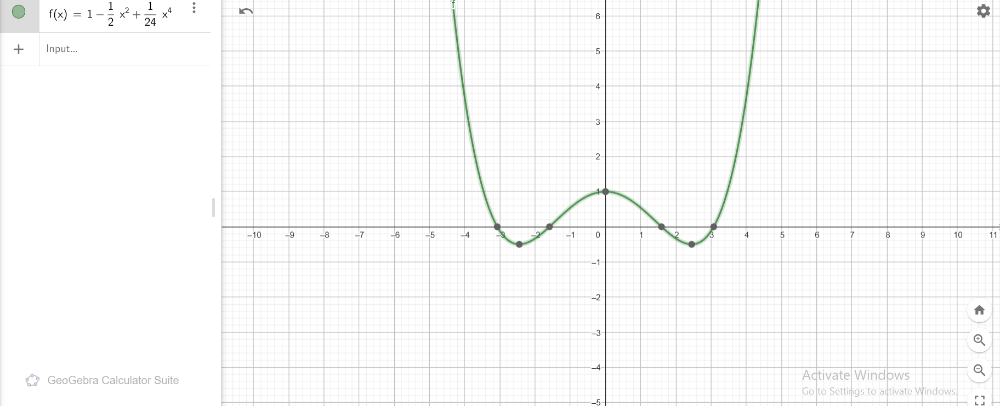

# 22 EXTREMUM 

1.The profit function is given as:  
$
P(u) = -2u^2 + 50u - 300
$  
where $u$ is the number of units sold.

To find the number of units that maximize the profit, we need to determine the critical point by finding the vertex of this quadratic function. Since the coefficient of $u^2$ is negative ($-2$), this is a parabola that opens downward, and the vertex represents the maximum point.

---

#### Step 1: Use the vertex formula  
For a quadratic function $ax^2 + bx + c$, the $x$-coordinate of the vertex is given by:  
$
u = -\frac{b}{2a}
$  

Here, $a = -2$ and $b = 50$. Substituting these values:  
$
u = -\frac{50}{2(-2)} = \frac{50}{4} = 12.5
$  
--- 

#### Final Answer:
The number of units that maximize profit is $u = 12.5$ (or 12/13 if a whole number is needed).
----------------------------------------------
-----------------------------------------------
----------------------------------------------
# 2.  
We are given 10 meters of string and need to use it to enclose the largest possible rectangular area.

Let the dimensions of the rectangle be:
- Length = $L$
- Width = $W$

The perimeter of a rectangle is given by the formula:
$$
P = 2L + 2W
$$
Since we have 10 meters of string, the perimeter is 10, so we have the equation:
$$
2L + 2W = 10
$$
Simplifying:
$$
L + W = 5
$$
This equation represents the relationship between the length and width of the rectangle.

---

#### Step 1: Maximize the area
The area $A$ of the rectangle is given by:
$$
A = L \times W
$$

Using the equation $L + W = 5$, we can express $W$ as:
$$
W = 5 - L
$$

Substitute this into the area formula:
$$
A = L \times (5 - L) = 5L - L^2
$$

Now, we need to maximize the area function $A(L) = 5L - L^2$. This is a quadratic function, and the maximum area occurs at the vertex.

---

#### Step 2: Find the vertex of the quadratic function
For a quadratic function of the form $A(L) = -L^2 + 5L$, the $L$-coordinate of the vertex is given by the formula:
$$
L = -\frac{b}{2a}
$$
where $a = -1$ and $b = 5$.
--------------------------------------------------
# 3.
### Solution

We are given the function:  
$$
f(x) = x^2 + 3x - 5
$$

To find the extremum of the function (i.e., the critical points where the function attains a local maximum or minimum), we need to follow these steps:

---

#### Step 1: Find the first derivative
The first derivative of $f(x)$ gives the rate of change of the function. To find the critical points, we take the derivative of $f(x)$ with respect to $x$:

$$
f'(x) = \frac{d}{dx} (x^2 + 3x - 5)
$$

Using basic differentiation rules:
$$
f'(x) = 2x + 3
$$

---

#### Step 2: Set the first derivative equal to zero
To find the critical points, we set the first derivative equal to zero:
$$
2x + 3 = 0
$$

Solve for $x$:
$$
2x = -3
$$
$$
x = -\frac{3}{2}
$$

Thus, the critical point is at $x = -\frac{3}{2}$.

---

#### Step 3: Determine whether it is a maximum or minimum
To determine whether this critical point is a local maximum or minimum, we calculate the second derivative of $f(x)$:

$$
f''(x) = \frac{d}{dx} (2x + 3) = 2
$$

Since $f''(x) = 2$ is positive, the function is concave up at $x = -\frac{3}{2}$. This means the critical point is a **local minimum**.

---

#### Final Answer:
The function $f(x) = x^2 + 3x - 5$ has a local minimum at:
$$
x = -\frac{3}{2}
$$
To find the value of the function at this point, we substitute $x = -\frac{3}{2}$ into the original function:

$$
f\left( -\frac{3}{2} \right) = \left( -\frac{3}{2} \right)^2 + 3\left( -\frac{3}{2} \right) - 5
$$

Simplifying:
$$
f\left( -\frac{3}{2} \right) = \frac{9}{4} - \frac{9}{2} - 5
$$
$$
f\left( -\frac{3}{2} \right) = \frac{9}{4} - \frac{18}{4} - \frac{20}{4}
$$
$$
f\left( -\frac{3}{2} \right) = \frac{-29}{4}
$$

Thus, the local minimum value is:
$$
f\left( -\frac{3}{2} \right) = -\frac{29}{4}
$$

--------------------------------------------------------
# 4 solution

We are given the function:  
$$
f(x) = x^2 + 2x + \frac{1}{x} - 1
$$

To find the extremum (critical points) of the function, we need to follow these steps:

---

#### Step 1: Find the first derivative
The first derivative of $f(x)$ gives the rate of change of the function. To find the critical points, we take the derivative of $f(x)$ with respect to $x$:

$$
f'(x) = \frac{d}{dx} \left( x^2 + 2x + \frac{1}{x} - 1 \right)
$$

Using basic differentiation rules:
$$
f'(x) = 2x + 2 - \frac{1}{x^2}
$$

---

#### Step 2: Set the first derivative equal to zero
To find the critical points, we set the first derivative equal to zero:
$$
2x + 2 - \frac{1}{x^2} = 0
$$

Multiply through by $x^2$ to eliminate the fraction:
$$
x^2(2x + 2) - 1 = 0
$$
$$
2x^3 + 2x^2 - 1 = 0
$$

For simplicity, let's try potential simple values for $x$. We test $x = -1$:

Substituting $x = -1$ into $2x^3 + 2x^2 - 1$:
$$
2(-1)^3 + 2(-1)^2 - 1 = -2 + 2 - 1 = -1
$$

So, $x = -1$ is **not** a solution. Let's proceed to numerical methods to solve this cubic equation.

---

#### Step 3: Numerical methods or graphing
At this point, we would use numerical methods (such as Newton's method) or a graphing tool to approximate the solution of the equation $2x^3 + 2x^2 - 1 = 0$. 

---

#### Final Answer:
The exact critical points may require further solving of the cubic equation, and numerical methods or estimation would give the precise values for $x$.
----------------------------------------

# 23 Taylor Series
### Solution

We are asked to find the Taylor series expansions of the following functions up to the 4th degree.

---

### 1. Taylor series of $f(x) = \cos(x)$ around $x = 0$ up to the 4th degree

The general form of the Taylor series for a function $f(x)$ around $x = 0$ is:
$$
f(x) = f(0) + f'(0)x + \frac{f''(0)}{2!}x^2 + \frac{f^{(3)}(0)}{3!}x^3 + \frac{f^{(4)}(0)}{4!}x^4 + \cdots
$$

For $f(x) = \cos(x)$, we compute the derivatives at $x = 0$:

- $f(x) = \cos(x)$, so $f(0) = 1$
- $f'(x) = -\sin(x)$, so $f'(0) = 0$
- $f''(x) = -\cos(x)$, so $f''(0) = -1$
- $f^{(3)}(x) = \sin(x)$, so $f^{(3)}(0) = 0$
- $f^{(4)}(x) = \cos(x)$, so $f^{(4)}(0) = 1$

Now, substitute these into the Taylor series formula:
$$
f(x) = 1 + 0 \cdot x + \frac{-1}{2!}x^2 + 0 \cdot x^3 + \frac{1}{4!}x^4
$$
Simplifying:
$$
f(x) = 1 - \frac{1}{2}x^2 + \frac{1}{24}x^4
$$

Thus, the Taylor series for $f(x) = \cos(x)$ around $x = 0$ up to the 4th degree is:
$$
f(x) = 1 - \frac{1}{2}x^2 + \frac{1}{24}x^4
$$

---

### 2. Taylor series of $h(x) = \frac{1}{1 - x}$ around $x = 0$ up to the 4th degree

For $h(x) = \frac{1}{1 - x}$, we recognize this as a standard geometric series. The Taylor series expansion for $\frac{1}{1 - x}$ around $x = 0$ is given by:
$$
h(x) = 1 + x + x^2 + x^3 + x^4 + \cdots
$$

Thus, the Taylor series for $h(x) = \frac{1}{1 - x}$ around $x = 0$ up to the 4th degree is:
$$
h(x) = 1 + x + x^2 + x^3 + x^4
$$

---

### 3. Taylor series of $g(x) = \sin(x)$ around $x = \pi$ up to the 4th degree

The general form of the Taylor series for a function $g(x)$ around $x = \pi$ is:
$$
g(x) = g(\pi) + g'(\pi)(x - \pi) + \frac{g''(\pi)}{2!}(x - \pi)^2 + \frac{g^{(3)}(\pi)}{3!}(x - \pi)^3 + \frac{g^{(4)}(\pi)}{4!}(x - \pi)^4 + \cdots
$$

For $g(x) = \sin(x)$, we compute the derivatives at $x = \pi$:

- $g(x) = \sin(x)$, so $g(\pi) = 0$
- $g'(x) = \cos(x)$, so $g'(\pi) = -1$
- $g''(x) = -\sin(x)$, so $g''(\pi) = 0$
- $g^{(3)}(x) = -\cos(x)$, so $g^{(3)}(\pi) = 1$
- $g^{(4)}(x) = \sin(x)$, so $g^{(4)}(\pi) = 0$

Now, substitute these into the Taylor series formula:
$$
g(x) = 0 + (-1)(x - \pi) + \frac{0}{2!}(x - \pi)^2 + \frac{1}{3!}(x - \pi)^3 + \frac{0}{4!}(x - \pi)^4
$$
Simplifying:
$$
g(x) = -(x - \pi) + \frac{1}{6}(x - \pi)^3
$$

Thus, the Taylor series for $g(x) = \sin(x)$ around $x = \pi$ up to the 4th degree is:
$$
g(x) = -(x - \pi) + \frac{1}{6}(x - \pi)^3
$$

---

### Final Answers:
1. The Taylor series of $f(x) = \cos(x)$ around $x = 0$ up to the 4th degree is:
$$
f(x) = 1 - \frac{1}{2}x^2 + \frac{1}{24}x^4
$$

2. The Taylor series of $h(x) = \frac{1}{1 - x}$ around $x = 0$ up to the 4th degree is:
$$
h(x) = 1 + x + x^2 + x^3 + x^4
$$

3. The Taylor series of $g(x) = \sin(x)$ around $x = \pi$ up to the 4th degree is:
$$
g(x) = -(x - \pi) + \frac{1}{6}(x - \pi)^3
$$
 ---------------------------------------------------

 # 2
 
We are tasked with finding the equation of the tangent line to the function \( f(x) = e^{\sin(x)} \) at \( x_0 = \pi \).

#### Step 1: Compute the derivative of \( f(x) = e^{\sin(x)} \)

First, we need to find the derivative of \( f(x) \).

Using the chain rule:
$$
f'(x) = \frac{d}{dx} \left( e^{\sin(x)} \right) = e^{\sin(x)} \cdot \cos(x)
$$

#### Step 2: Evaluate \( f(\pi) \) and \( f'(\pi) \)

Next, we calculate \( f(\pi) \) and \( f'(\pi) \).

- \( f(\pi) = e^{\sin(\pi)} = e^0 = 1 \)
- \( f'(\pi) = e^{\sin(\pi)} \cdot \cos(\pi) = 1 \cdot (-1) = -1 \)

Thus, at \( x_0 = \pi \):
- The point on the function is \( (\pi, 1) \)
- The slope of the tangent line is \( -1 \)

#### Step 3: Equation of the tangent line

The formula for the tangent line to a function \( f(x) \) at a point \( x_0 \) is:
$$
y = f'(x_0) \cdot (x - x_0) + f(x_0)
$$

Substituting \( x_0 = \pi \), \( f(\pi) = 1 \), and \( f'(\pi) = -1 \):
$$
y = -1 \cdot (x - \pi) + 1
$$

Simplifying:
$$
y = -x + \pi + 1
$$

Thus, the equation of the tangent line is:
$$
y = -x + \pi + 1
$$

---