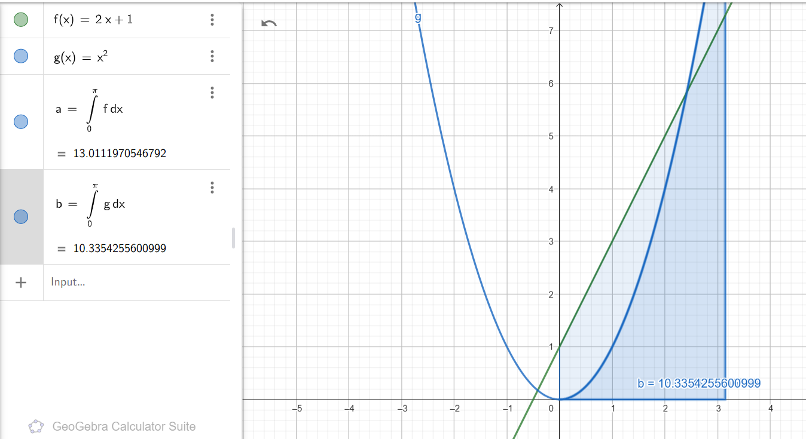
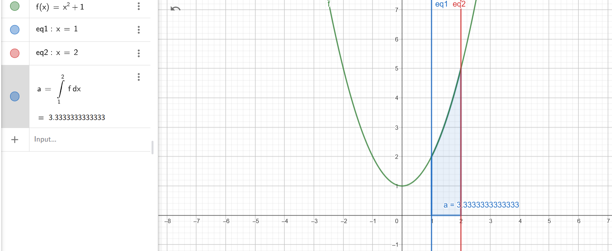
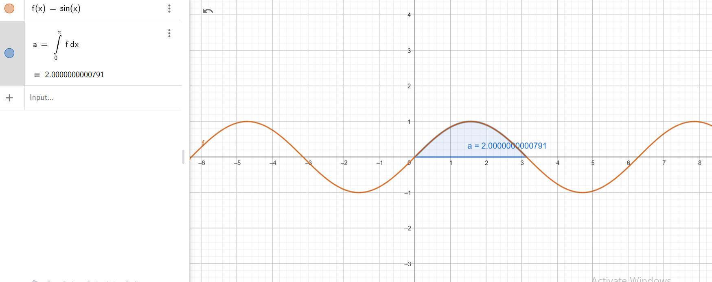

# Solutions to the Integrals

## 1. ∫ 1 dx
$$
\int 1dx = x + C
$$

---

## 2. ∫ (x² + 2) dx
Using the power rule: $$
 \int x^n dx = \frac{x^{n+1}}{n+1} $$,

$$
\int (x^2 + 2)dx = \frac{x^3}{3} + 2x + C
$$

---

## 3. ∫ 2sin(x) dx
Using the integral of sine: $$ \int \sin(x) dx = -\cos(x) $$,

$$
\int 2\sin(x)dx = -2\cos(x) + C
$$

---

## 4. ∫ (3/x) dx
Using the integral of $$ \frac{1}{x} $$: $$ \int \frac{1}{x}dx = \ln |x| $$,

$$
\int \frac{3}{x}dx = 3\ln|x| + C
$$

---

## 5. ∫ (1/x²) dx
Rewriting $$ \frac{1}{x^2} $$ as $$ x^{-2} $$ and using the power rule:

$$
\int x^{-2} dx = \frac{x^{-1}}{-1} = -\frac{1}{x} + C
$$

---

## 6. ∫ (1/3 x⁴ - 5) dx
Using the power rule:

$$
\int \left(\frac{1}{3}x^4 - 5\right)dx = \frac{1}{3} \cdot \frac{x^5}{5} - 5x + C
$$

$$
= \frac{x^5}{15} - 5x + C
$$

---

## 7. ∫ (sin²x + cos²x) dx
Since \( \sin^2 x + \cos^2 x = 1 \),

$$
\int (\sin^2 x + \cos^2 x)dx = \int 1dx = x + C
$$

---

## 8. ∫ (5sinx + 3e^x) dx
$$
\int 5\sin x dx = -5\cos x
$$

$$
\int 3e^x dx = 3e^x
$$

$$
\therefore \int (5\sin x + 3e^x)dx = -5\cos x + 3e^x + C
$$

---

## 9. ∫ 3√x dx
Rewriting $$ \sqrt{x} $$ as $$ x^{1/2} $$:

$$
\int 3x^{1/2} dx = 3 \cdot \frac{x^{3/2}}{3/2} = 2x^{3/2} + C
$$

---

## 10. ∫ √10x dx
Since $$ \sqrt{10} $$ is a constant,

$$
\int \sqrt{10}x dx = \sqrt{10} \int xdx = \sqrt{10} \cdot \frac{x^2}{2} + C
$$

---

## 11. ∫ cos(5/2 x + 3) dx
Using the integral formula for cosine: $$ \int \cos(ax + b)dx = \frac{\sin(ax + b)}{a} $$,

$$
\int \cos\left(\frac{5}{2}x + 3\right)dx = \frac{\sin\left(\frac{5}{2}x + 3\right)}{5/2} + C
$$

$$
= \frac{2}{5} \sin\left(\frac{5}{2}x + 3\right) + C
$$

---

## 12. ∫ (cos(ln(x))/x) dx
Using substitution: $$ u = \ln(x), $$ so $$ du = \frac{dx}{x} ,

$$
\int \frac{\cos(\ln(x))}{x}dx = \int \cos(u)du = \sin(u) + C
$$

$$
= \sin(\ln(x)) + C
$$

---

## 13. ∫ xln(x) dx
Using integration by parts: $$ u = \ln(x), dv = x dx $$,

$$
du = \frac{1}{x}dx, v = \frac{x^2}{2}
$$

$$
\int x\ln(x)dx = \frac{x^2}{2} \ln(x) - \int \frac{x^2}{2} \cdot \frac{1}{x}dx
$$

$$
= \frac{x^2}{2} \ln(x) - \frac{x^2}{4} + C
$$

---

## 14. ∫ xe^x dx
Using integration by parts: $$ u = x, dv = e^x dx $$,

$$
du = dx, v = e^x
$$

$$
\int xe^x dx = x e^x - \int e^x dx
$$

$$
= x e^x - e^x + C
$$

----------------------------------------

# Definite Integrals over $$[0, \pi]$$

Given functions:

- $$ f(x) = 2x + 1 $$
- $$ g(x) = x^2 $$

We calculate the definite integrals over the interval $$[0, \pi]$$:

## 1. Integral of $$ f(x) = 2x + 1 $$

$$
\int_{0}^{\pi} (2x + 1)dx
$$

### Solution:

Using the power rule for integration:

$$
\int (2x + 1)dx = x^2 + x
$$

Evaluating from $$ 0 $$ to $$ \pi $$:

$$
\left[ x^2 + x \right]_{0}^{\pi}
$$

$$
= (\pi^2 + \pi) - (0^2 + 0)
$$

$$
= \pi^2 + \pi
$$

**Final Result:**
$$
\int_{0}^{\pi} (2x + 1)dx = \pi + \pi^2
$$

---

## 2. Integral of \( g(x) = x^2 \)

$$
\int_{0}^{\pi} x^2dx
$$

### Solution:

Using the power rule:

$$
\int x^2dx = \frac{x^3}{3}
$$

Evaluating from $$ 0 $$ to $$ \pi $$:

$$
\left[ \frac{x^3}{3} \right]_{0}^{\pi}
$$

$$
= \frac{\pi^3}{3} - \frac{0^3}{3}
$$

$$
= \frac{\pi^3}{3}
$$

**Final Result:**
$$
\int_{0}^{\pi} x^2dx = \frac{\pi^3}{3}
$$

---

### Summary of Results:

1. $$ \int_{0}^{\pi} (2x + 1)dx = \pi + \pi^2 $$
2. $$ \int_{0}^{\pi} x^2dx = \frac{\pi^3}{3} $$
 

---

## **Step 1: Define the Problem**
We need to find the area of the region bounded by:
- **Vertical boundaries**: $$x = 1 $$ and $$ x = 2 $$
- **Horizontal boundary**: $$ y = 0 $$ (x-axis)
- **Upper function**: $$ y = x^2 + 1 $$

This means we compute the definite integral:

$$
A = \int_{1}^{2} (x^2 + 1) \,dx
$$

---

## **Step 2: Compute the Definite Integral**
### **Solving the integral:**
Using the power rule:

$$
\int (x^2 + 1)dx = \frac{x^3}{3} + x
$$

Evaluating from $$ x = 1 $$ to $$ x = 2 $$:

$$
A = \left[ \frac{x^3}{3} + x \right]_{1}^{2}
$$

Substituting the limits:

$$
A = \left( \frac{2^3}{3} + 2 \right) - \left( \frac{1^3}{3} + 1 \right)
$$

$$
= \left( \frac{8}{3} + 2 \right) - \left( \frac{1}{3} + 1 \right)
$$

$$
= \left( \frac{8}{3} + \frac{6}{3} \right) - \left( \frac{1}{3} + \frac{3}{3} \right)
$$

$$
= \frac{14}{3} - \frac{4}{3}
$$

$$
= \frac{10}{3}
$$

### **Final Answer:**
$$
A = \frac{10}{3} \approx 3.33
$$

--------------------------------------

# **Calculating the Area Under the Sine Curve**

## **Step 1: Define the Problem**
We need to compute the area under the sine curve $$ y = \sin(x) $$ over the interval $$[0, \pi]$$:

$$
A = \int_{0}^{\pi} \sin(x) \,dx
$$

---

## **Step 2: Compute the Definite Integral**
Using the integral formula:

$$
\int \sin(x) dx = -\cos(x)
$$

Evaluating from $$ 0 $$ to $$ \pi $$:

$$
A = \left[ -\cos(x) \right]_{0}^{\pi}
$$

$$
= \left( -\cos(\pi) \right) - \left( -\cos(0) \right)
$$

$$
= (-(-1)) - (-1)
$$

$$
= 1 + 1
$$

$$
= 2
$$

---

## **Final Answer:**
$$
A = 2
$$

-------------------------------------------------------

# **Finding the Distance of a Moving Particle**

## **Step 1: Given Position Function**
The position of a moving particle is:

$$
x(t) = 3t^2 - 6t + 1
$$

We need to find the total **distance traveled** from $$ t = 0 $$ to $$ t = 2 $$.

---

## **Step 2: Compute the Velocity Function**
The velocity function is:

$$
v(t) = \frac{dx}{dt} = 6t - 6
$$

Set $$ v(t) = 0 $$ to find when the particle changes direction:

$$
6t - 6 = 0
$$

$$
t = 1
$$

Since the velocity changes **sign** at $$ t = 1 $$, we must compute the absolute displacement separately in two intervals: **[0,1]** and **[1,2]**.

---

## **Step 3: Compute the Distance in Each Interval**
### **From $$ t = 0 $$ to $$ t = 1 $$:**
Since $$ v(t) $$ is negative for $$ t < 1 $$, we use $$ |6t - 6| = -(6t - 6) = 6 - 6t $$:

$$
\int_{0}^{1} (6 - 6t) dt
$$

Computing the integral:

$$
\left[ 6t - 3t^2 \right]_{0}^{1}
$$

$$
= (6(1) - 3(1)^2) - (6(0) - 3(0)^2)
$$

$$
= (6 - 3) - 0 = 3
$$

### **From \( t = 1 \) to \( t = 2 \):**
Since \( v(t) \) is positive for \( t > 1 \), we use \( |6t - 6| = 6t - 6 \):

$$
\int_{1}^{2} (6t - 6) dt
$$

Computing the integral:

$$
\left[ 3t^2 - 6t \right]_{1}^{2}
$$

$$
= (3(2)^2 - 6(2)) - (3(1)^2 - 6(1))
$$

$$
= (12 - 12) - (3 - 6) = 0 + 3 = 3
$$

---

## **Final Answer:**
Adding both distances:

$$
\text{Total Distance} = 3 + 3 = 6
$$

**Total distance traveled:**
$$
\boxed{6}
$$
---------------------------------------------

# **Solving First-Order Differential Equations**

## **1. Solve $$ y'(x) = y(x) $$**

This is a **separable differential equation**:

$$
\frac{dy}{dx} = y
$$

Rewriting:

$$
\frac{dy}{y} = dx
$$

Integrating both sides:

$$
\int \frac{dy}{y} = \int dx
$$

$$
\ln |y| = x + C
$$

Solving for \( y(x) \):

$$
y(x) = e^{x + C} = Ce^x
$$

where $$ C = e^C $$ is an arbitrary constant.

### **Final Solution:**
$$
y(x) = C e^x
$$

---

## **2. Solve $$ y'(x) = \frac{1}{2y(x)} $$**

This is a **separable differential equation**:

$$
2y \frac{dy}{dx} = 1
$$

Rewriting:

$$
2y dy = dx
$$

Integrating both sides:

$$
\int 2y dy = \int dx
$$

$$
y^2 = \frac{x}{2} + C
$$

Solving for $$ y(x) $$:

$$
y(x) = \pm \sqrt{\frac{x}{2} + C}
$$

### **Final Solution:**
$$
y(x) = \pm \sqrt{\frac{x}{2} + C}
$$

---

# **Solving First-Order Differential Equations using Separation of Variables**

## **1. Solve $$ \frac{dy}{dx} = \frac{x}{y} $$**

Rearrange:

$$
y \, dy = x \, dx
$$

Integrate both sides:

$$
\int y \, dy = \int x \, dx
$$

$$
\frac{y^2}{2} = \frac{x^2}{2} + C
$$

Multiply by 2:

$$
y^2 = x^2 + C
$$

### **Final Solution:**
$$
y = \pm \sqrt{x^2 + C}
$$

---

## **2. Solve $$ \frac{dy}{dx} = \frac{y}{x} $$**

Rearrange:

$$
\frac{dy}{y} = \frac{dx}{x}
$$

Integrate both sides:

$$
\int \frac{dy}{y} = \int \frac{dx}{x}
$$

$$
\ln |y| = \ln |x| + C
$$

Solve for $$ y $$:

$$
y = Cx
$$

### **Final Solution:**
$$
y = Cx
$$

---

## **3. Solve $$ \frac{dy}{dx} = xy $$**

Rearrange:

$$
\frac{dy}{y} = x dx
$$

Integrate both sides:

$$
\int \frac{dy}{y} = \int x dx
$$

$$
\ln |y| = \frac{x^2}{2} + C
$$

Solve for $$ y $$:

$$
y = e^{C} e^{x^2 / 2}
$$

Since $$ e^C $$ is just a constant $$ C $$, we write:

### **Final Solution:**
$$
y = C e^{x^2 / 2}
$$

---

## **Summary of Solutions**
1. $$ y = \pm \sqrt{x^2 + C} $$
2. $$ y = Cx $$
3. $$ y = C e^{x^2 / 2} $$

---

# **Solving Second-Order Ordinary Differential Equations**

## **1. Solve $$ y''(x) + y'(x) = 0 $$**
### **Step 1: Find the Characteristic Equation**
$$
r^2 + r = 0
$$

$$
r(r + 1) = 0 \Rightarrow r = 0, -1
$$

### **Step 2: General Solution**
$$
y(x) = C_1 + C_2 e^{-x}
$$

### **Step 3: Apply Boundary Conditions**
Using $$ y(0) = 2 $$ and $$ y'(0) = -1 $$:

$$
C_1 + C_2 = 2, \quad -C_2 = -1
$$

Solving for $$ C_1, C_2 $$:

$$
C_2 = 1, \quad C_1 = 1
$$

### **Final Solution:**
$$
y(x) = 1 + e^{-x}
$$

---

## **2. Solve $$ y''(x) - y(x) = 0 $$**

### **Step 1: Find the Characteristic Equation**
$$
r^2 - 1 = 0 \Rightarrow r = \pm 1
$$

### **Step 2: General Solution**
$$
y(x) = C_1 e^x + C_2 e^{-x}
$$

### **Step 3: Apply Boundary Conditions**
Using $$ y(0) = 2 $$ and $$ y'(0) = 0 $$:

$$
C_1 + C_2 = 2, \quad C_1 - C_2 = 0
$$

Solving for $$ C_1, C_2 $$:

$$
C_1 = 1, C_2 = 1
$$

### **Final Solution: **
$$
y(x) = e^x + e^{-x}
$$

---

## **3. Solve $$ \frac{d^2y}{dx^2} = -\omega^2 y(x) $$**

### **Step 1: Find the Characteristic Equation**
$$
r^2 + \omega^2 = 0
$$

$$
r = \pm i\omega
$$

### **Step 2: General Solution**
$$
y(x) = C_1 \cos(\omega x) + C_2 \sin(\omega x)
$$

---

## **Summary of Solutions**
1. $$ y(x) = 1 + e^{-x} $$
2. $$ y(x) = e^x + e^{-x} $$
3. $$ y(x) = C_1 \cos(\omega x) + C_2 \sin(\omega x) $$

---

# **Checking if $$ \psi(t, x) = A \cos(\omega t + kx) $$ satisfies the wave equation**

We verify whether the function satisfies the **wave equation**:

$$
\frac{\partial^2 \psi}{\partial t^2} - v^2 \frac{\partial^2 \psi}{\partial x^2} = 0
$$

where $$ v = \frac{\omega}{k} $$.

---

## **Step 1: Compute $$ \frac{\partial^2 \psi}{\partial t^2} $$**

First derivative with respect to $$ t $$:

$$
\frac{\partial \psi}{\partial t} = -A\omega \sin(\omega t + kx)
$$

Second derivative:

$$
\frac{\partial^2 \psi}{\partial t^2} = -A\omega^2 \cos(\omega t + kx)
$$

---

## **Step 2: Compute $$ \frac{\partial^2 \psi}{\partial x^2} $$**

First derivative with respect to $$ x $$:

$$
\frac{\partial \psi}{\partial x} = -A k \sin(\omega t + kx)
$$

Second derivative:

$$
\frac{\partial^2 \psi}{\partial x^2} = -A k^2 \cos(\omega t + kx)
$$

---

## **Step 3: Substitute into the Wave Equation**

$$
\frac{\partial^2 \psi}{\partial t^2} - v^2 \frac{\partial^2 \psi}{\partial x^2}
$$

Substituting:

$$
- A\omega^2 \cos(\omega t + kx) + v^2 (-A k^2 \cos(\omega t + kx))
$$

Using $$ v^2 = \frac{\omega^2}{k^2} $$:

$$
- A\omega^2 \cos(\omega t + kx) + \frac{\omega^2}{k^2} A k^2 \cos(\omega t + kx) = 0
$$

Since both terms cancel:

$$
0 = 0
$$

Thus, **$$ \psi(t, x) $$ satisfies the wave equation**

---

