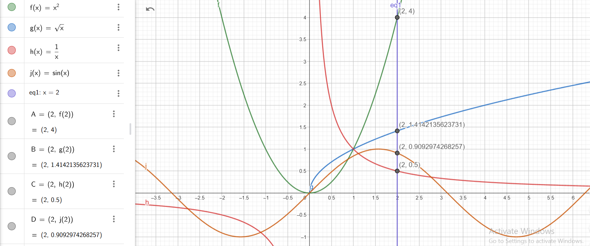

Let \( f(x) = 3x - 1 \) and \( g(x) = \sqrt{x} \). We compute:

---

### 1. \( f(g(x)) \)
Substitute \( g(x) = \sqrt{x} \) into \( f(x) = 3x - 1 \):
$$
f(g(x)) = f(\sqrt{x}) = 3(\sqrt{x}) - 1 = 3\sqrt{x} - 1
$$

---

### 2. \( g(f(x)) \)
Substitute \( f(x) = 3x - 1 \) into \( g(x) = \sqrt{x} \):
$$
g(f(x)) = g(3x - 1) = \sqrt{3x - 1}
$$

**Domain Constraint**: For \( g(f(x)) \) to be valid, we require \( 3x - 1 \geq 0 \):
$$
3x \geq 1 \implies x \geq \frac{1}{3}
$$

---

### 3. \( f(f(x)) \)
Substitute \( f(x) = 3x - 1 \) into itself:
$$
f(f(x)) = f(3x - 1) = 3(3x - 1) - 1 = 9x - 3 - 1 = 9x - 4
$$

---

### 4. \( g(g(x)) \)
Substitute \( g(x) = \sqrt{x} \) into itself:
$$
g(g(x)) = g(\sqrt{x}) = \sqrt{\sqrt{x}} = \sqrt[4]{x}
$$

**Domain Constraint**: Since \( g(x) = \sqrt{x} \), the domain of \( g(g(x)) \) is \( x \geq 0 \).

---

### Final Results:
1. \( f(g(x)) = 3\sqrt{x} - 1 \)
2. \( g(f(x)) = \sqrt{3x - 1}, \text{ valid for } x \geq \frac{1}{3} \)
3. \( f(f(x)) = 9x - 4 \)
4. \( g(g(x)) = \sqrt[4]{x}, \text{ valid for } x \geq 0 \)
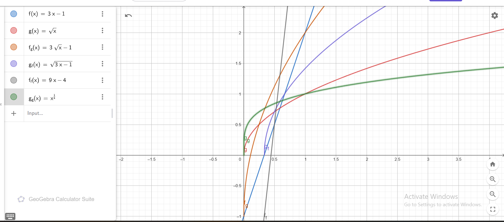

Let \( f(x) = e^x \) and \( g(x) = \ln(x) \). We compute the compositions \( f(g(x)) \) and \( g(f(x)) \):

---

### 1. \( f(g(x)) \)
Substitute \( g(x) = \ln(x) \) into \( f(x) = e^x \):
\[
f(g(x)) = f(\ln(x)) = e^{\ln(x)}
\]

Using the property of logarithms and exponentials (\( e^{\ln(x)} = x \), valid for \( x > 0 \)):
\[
f(g(x)) = x \quad \text{for } x > 0
\]

---

### 2. \( g(f(x)) \)
Substitute \( f(x) = e^x \) into \( g(x) = \ln(x) \):
\[
g(f(x)) = g(e^x) = \ln(e^x)
\]

Using the property of logarithms (\( \ln(e^x) = x \)):
\[
g(f(x)) = x \quad \text{for all } x
\]

---

### Observations
1. \( f(g(x)) = x \) is the **identity function**, valid for \( x > 0 \).
2. \( g(f(x)) = x \) is also the **identity function**, valid for all \( x \).

This shows that the functions \( f(x) = e^x \) and \( g(x) = \ln(x) \) are **inverses of each other**.
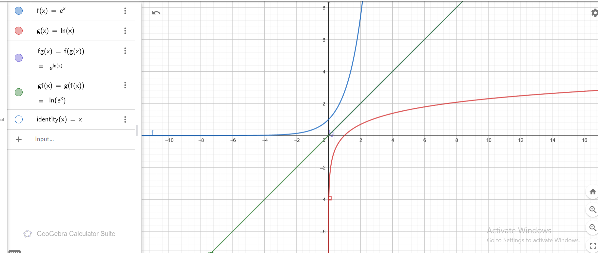

We are given the function:
\[
f = \{(1,7), (2,9), (3,11)\}
\]

### Definition of the Inverse Function:
The inverse function \(f^{-1}\) swaps the \(x\)- and \(y\)-coordinates of each pair in \(f\). That is:
\[
f^{-1} = \{(y, x) : (x, y) \in f\}
\]

---

### Compute \(f^{-1}\):
From the given function \(f = \{(1,7), (2,9), (3,11)\}\), we swap the pairs:
- Swap \((1, 7)\) to \((7, 1)\),
- Swap \((2, 9)\) to \((9, 2)\),
- Swap \((3, 11)\) to \((11, 3)\).

Thus, the inverse function is:
\[
f^{-1} = \{(7, 1), (9, 2), (11, 3)\}
\]

---

### Final Answer:
\[
f^{-1} = \{(7, 1), (9, 2), (11, 3)\}
\]
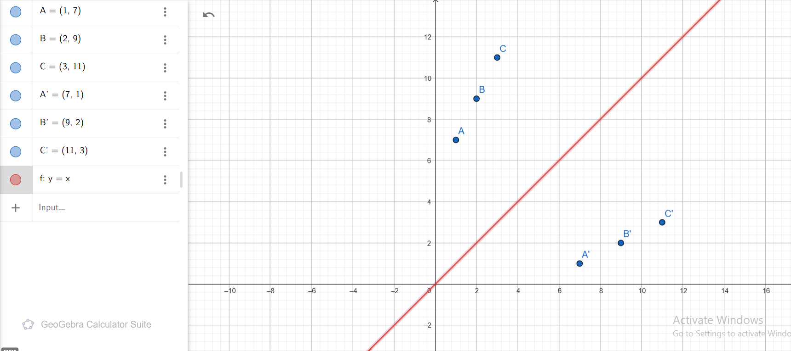

We are given the function:
\[
f = \{(1,7), (2,7), (3,11)\}
\]

### Definition of the Inverse Function:
The inverse function \(f^{-1}\) swaps the \(x\)- and \(y\)-coordinates of each pair in \(f\). That is:
\[
f^{-1} = \{(y, x) : (x, y) \in f\}
\]

---

### Compute \(f^{-1}\):
From the given function \(f = \{(1,7), (2,7), (3,11)\}\), we swap the pairs:
- Swap \((1, 7)\) to \((7, 1)\),
- Swap \((2, 7)\) to \((7, 2)\),
- Swap \((3, 11)\) to \((11, 3)\).

Thus, the inverse function is:
\[
f^{-1} = \{(7, 1), (7, 2), (11, 3)\}
\]

---

### Observations:
1. The value \(7\) in \(f\) maps to two different \(x\)-values (\(1\) and \(2\)) in \(f^{-1}\).
2. Hence, \(f^{-1}\) is not a function because a single input (\(7\)) maps to multiple outputs (\(1\) and \(2\)).

---

### Final Answer:
\[
f^{-1} = \{(7, 1), (7, 2), (11, 3)\}
\]
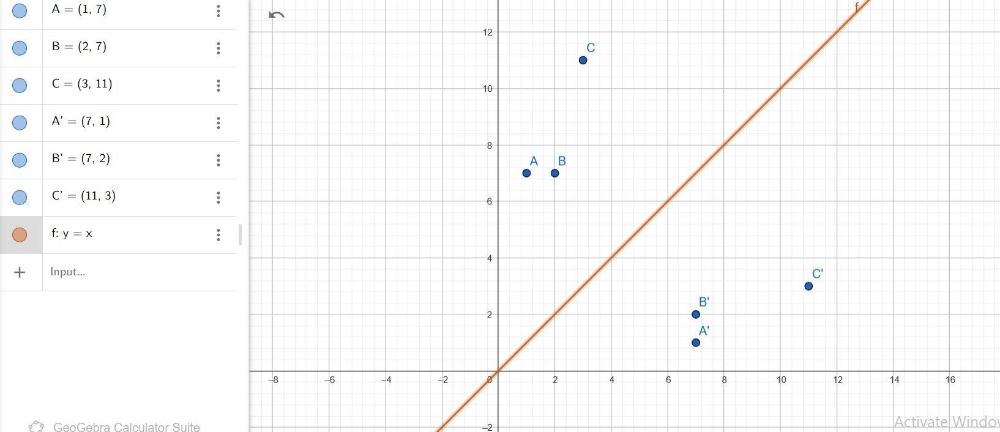

We are given the function:
\[
f(x) = x - 1
\]

### Definition of the Inverse Function:
The inverse function \(f^{-1}(x)\) satisfies the condition:
\[
f(f^{-1}(x)) = x \quad \text{and} \quad f^{-1}(f(x)) = x
\]

---

### Solve for \(f^{-1}(x)\):
To find the inverse, start with the equation:
\[
y = f(x) = x - 1
\]

1. Replace \(f(x)\) with \(y\):
   \[
   y = x - 1
   \]

2. Solve for \(x\) in terms of \(y\):
   \[
   x = y + 1
   \]

3. Replace \(y\) with \(x\) to get the inverse function:
   \[
   f^{-1}(x) = x + 1
   \]

---

### Final Answer:
The inverse function is:
\[
f^{-1}(x) = x + 1
\]
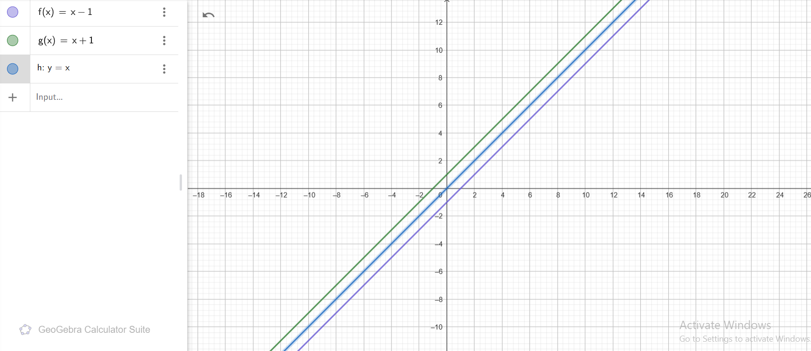

## 19. Limits of Sequences
### Problem:
Evaluate the following limits:
1. $\displaystyle \lim_{n \to \infty} \frac{n^2 + 3n}{2n^2 - 2n}$
2. $\displaystyle \lim_{n \to \infty} \frac{(2n+3)^3}{n^3-1}$

---

### Solution:

#### 1. $\displaystyle \lim_{n \to \infty} \frac{n^2 + 3n}{2n^2 - 2n}$

We start with the given expression:
$$
\lim_{n \to \infty} \frac{n^2 + 3n}{2n^2 - 2n}
$$

**Step 1: Factor out $n^2$ from the numerator and denominator:**
$$
\frac{n^2 + 3n}{2n^2 - 2n} = \frac{n^2(1 + \frac{3}{n})}{n^2(2 - \frac{2}{n})}
$$

**Step 2: Simplify by canceling $n^2$:**
$$
\frac{n^2(1 + \frac{3}{n})}{n^2(2 - \frac{2}{n})} = \frac{1 + \frac{3}{n}}{2 - \frac{2}{n}}
$$

**Step 3: Take the limit as $n \to \infty$:**
As $n \to \infty$, $\frac{3}{n} \to 0$ and $\frac{2}{n} \to 0$. Substituting these limits:
$$
\frac{1 + \frac{3}{n}}{2 - \frac{2}{n}} \to \frac{1 + 0}{2 - 0} = \frac{1}{2}
$$

**Answer for the first limit:**
$$
\lim_{n \to \infty} \frac{n^2 + 3n}{2n^2 - 2n} = \frac{1}{2}
$$

---

#### 2. $\displaystyle \lim_{n \to \infty} \frac{(2n+3)^3}{n^3-1}$

We start with the given expression:
$$
\lim_{n \to \infty} \frac{(2n+3)^3}{n^3-1}
$$

**Step 1: Expand the numerator $(2n + 3)^3$ using the binomial theorem:**
$$
(2n + 3)^3 = 8n^3 + 12n^2 \cdot 3 + 6n \cdot 9 + 27 = 8n^3 + 36n^2 + 54n + 27
$$

Thus, the expression becomes:
$$
\frac{(2n+3)^3}{n^3 - 1} = \frac{8n^3 + 36n^2 + 54n + 27}{n^3 - 1}
$$

**Step 2: Factor $n^3$ from the numerator and denominator:**
$$
\frac{8n^3 + 36n^2 + 54n + 27}{n^3 - 1} = \frac{n^3(8 + \frac{36}{n} + \frac{54}{n^2} + \frac{27}{n^3})}{n^3(1 - \frac{1}{n^3})}
$$

**Step 3: Simplify by canceling $n^3$:**
$$
\frac{n^3(8 + \frac{36}{n} + \frac{54}{n^2} + \frac{27}{n^3})}{n^3(1 - \frac{1}{n^3})} = \frac{8 + \frac{36}{n} + \frac{54}{n^2} + \frac{27}{n^3}}{1 - \frac{1}{n^3}}
$$

**Step 4: Take the limit as $n \to \infty$:**
As $n \to \infty$, $\frac{36}{n} \to 0$, $\frac{54}{n^2} \to 0$, $\frac{27}{n^3} \to 0$, and $\frac{1}{n^3} \to 0$. Substituting these limits:
$$
\frac{8 + 0 + 0 + 0}{1 - 0} = 8
$$

**Answer for the second limit:**
$$
\lim_{n \to \infty} \frac{(2n+3)^3}{n^3 - 1} = 8
$$

---

### Final Answers:
1. $\displaystyle \lim_{n \to \infty} \frac{n^2 + 3n}{2n^2 - 2n} = \frac{1}{2}$
2. $\displaystyle \lim_{n \to \infty} \frac{(2n+3)^3}{n^3 - 1} = 8$
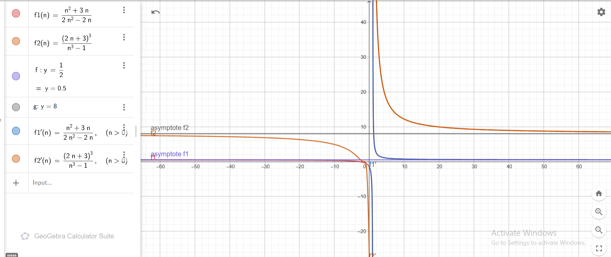

# Proof Using the Squeeze Theorem

We aim to prove:

$$
\lim_{n \to \infty} \frac{\sin(n)}{n} = 0
$$

using the **Squeeze Theorem**.

---

## Step 1: Recall the Squeeze Theorem

The Squeeze Theorem states that if:

$$
g(n) \leq f(n) \leq h(n), \quad \forall n \text{ in some domain},
$$

and:

$$
\lim_{n \to \infty} g(n) = \lim_{n \to \infty} h(n) = L,
$$

then:

$$
\lim_{n \to \infty} f(n) = L.
$$

---

## Step 2: Establish bounds for $ \frac{\sin(n)}{n} $

The sine function satisfies:

$$
-1 \leq \sin(n) \leq 1, \quad \forall n \in \mathbb{R}.
$$

Dividing through by $ n > 0 $ (for $ n \to \infty $) gives:

$$
-\frac{1}{n} \leq \frac{\sin(n)}{n} \leq \frac{1}{n}.
$$

Thus, we have bounded $ \frac{\sin(n)}{n} $ between two functions:

$$
-\frac{1}{n} \leq \frac{\sin(n)}{n} \leq \frac{1}{n}.
$$

---

## Step 3: Compute the limits of the bounding functions

The bounding functions $ -\frac{1}{n} $ and $ \frac{1}{n} $ approach $ 0 $ as $ n \to \infty $:

$$
\lim_{n \to \infty} -\frac{1}{n} = 0, \quad \lim_{n \to \infty} \frac{1}{n} = 0.
$$

By the Squeeze Theorem:

$$
\lim_{n \to \infty} \frac{\sin(n)}{n} = 0.
$$

---

## Conclusion

Thus, using the Squeeze Theorem:

$$
\boxed{\lim_{n \to \infty} \frac{\sin(n)}{n} = 0}.
$$
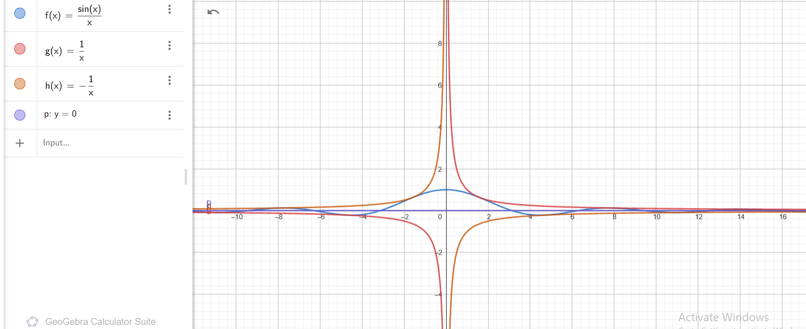

# Finding the Limit of the Sequence

We aim to find the limit of the sequence:

$$
a_n = \left(1 + \frac{1}{n}\right)^n
$$

as \( n \to \infty \).

---

## Step 1: Recognize the Sequence

The sequence \( a_n = \left(1 + \frac{1}{n}\right)^n \) is a well-known expression that converges to the mathematical constant \( e \). 

---

## Step 2: Recall the Definition of \( e \)

The constant \( e \) is defined as:

$$
e = \lim_{n \to \infty} \left(1 + \frac{1}{n}\right)^n.
$$

Thus, by definition:

$$
\lim_{n \to \infty} a_n = e.
$$

---

## Step 3: Rigorous Derivation (Optional)

For a rigorous derivation, we take the natural logarithm of the sequence:

$$
L = \ln(a_n) = \ln\left(\left(1 + \frac{1}{n}\right)^n\right) = n \ln\left(1 + \frac{1}{n}\right).
$$

Using the approximation \(\ln(1 + x) \approx x\) for small \(x\), we have:

$$
\ln\left(1 + \frac{1}{n}\right) \approx \frac{1}{n}.
$$

Substituting this back:

$$
L = n \cdot \frac{1}{n} = 1.
$$

Exponentiating both sides:

$$
a_n = e^L = e^1 = e.
$$

---

## Conclusion

The sequence converges to:

$$
\boxed{\lim_{n \to \infty} \left(1 + \frac{1}{n}\right)^n = e}.
$$
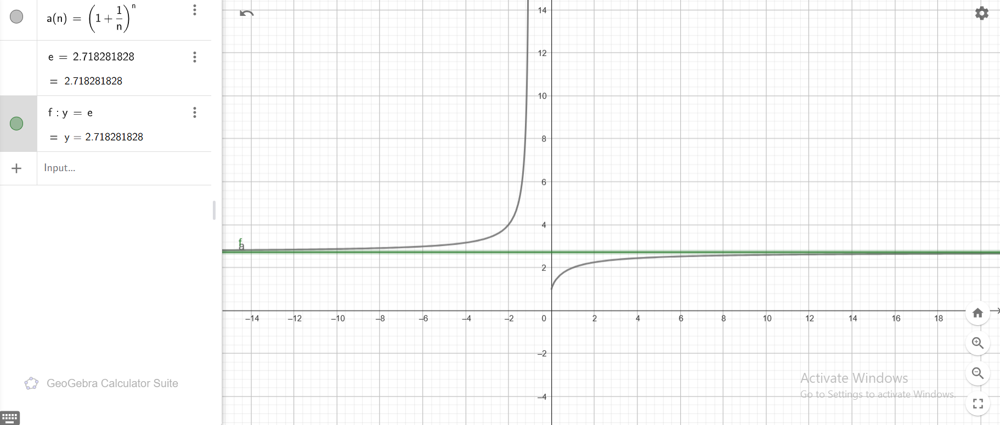

## 20. Limits of Real Functions
# Compute the Limit

We aim to compute:

$$
\lim_{x \to \infty} \frac{x^3 + 2x^2}{x^4 - 3x^3}.
$$

---

## Step 1: Factor out the highest power of \(x\)

The highest power of \(x\) in the numerator is \(x^3\), and in the denominator is \(x^4\). Divide both numerator and denominator by \(x^4\):

$$
\frac{x^3 + 2x^2}{x^4 - 3x^3} = \frac{\frac{x^3}{x^4} + \frac{2x^2}{x^4}}{\frac{x^4}{x^4} - \frac{3x^3}{x^4}}.
$$

Simplify each term:

$$
\frac{x^3 + 2x^2}{x^4 - 3x^3} = \frac{\frac{1}{x} + \frac{2}{x^2}}{1 - \frac{3}{x}}.
$$

---

## Step 2: Take the limit as \(x \to \infty\)

As \(x \to \infty\):
- \(\frac{1}{x} \to 0\),
- \(\frac{2}{x^2} \to 0\),
- \(\frac{3}{x} \to 0\).

Substitute these into the simplified expression:

$$
\lim_{x \to \infty} \frac{\frac{1}{x} + \frac{2}{x^2}}{1 - \frac{3}{x}} = \frac{0 + 0}{1 - 0} = 0.
$$

---

## Conclusion

The limit is:

$$
\boxed{0}.
$$
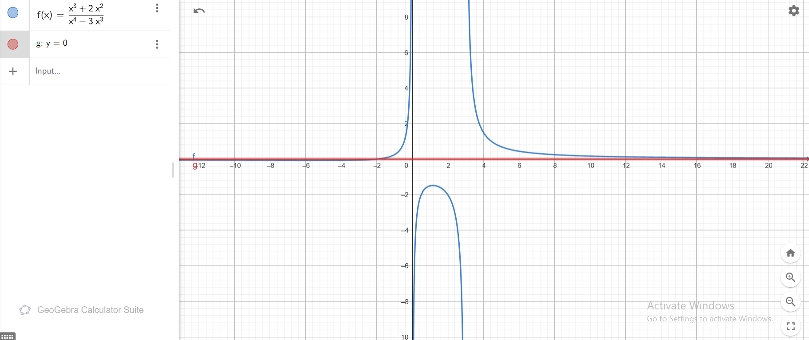

# Compute the Limit

We aim to compute:

$$
\lim_{x \to 0} \frac{\sin(3x)}{2x+1}.
$$

---

## Step 1: Direct Substitution

Substituting \(x = 0\) into the function:

$$
\frac{\sin(3x)}{2x+1} \quad \text{becomes} \quad \frac{\sin(0)}{2(0)+1} = \frac{0}{1} = 0.
$$

Thus, the value of the limit is directly:

$$
\boxed{0}.
$$

---

## Conclusion

The limit is:

$$
\lim_{x \to 0} \frac{\sin(3x)}{2x+1} = 0.
$$
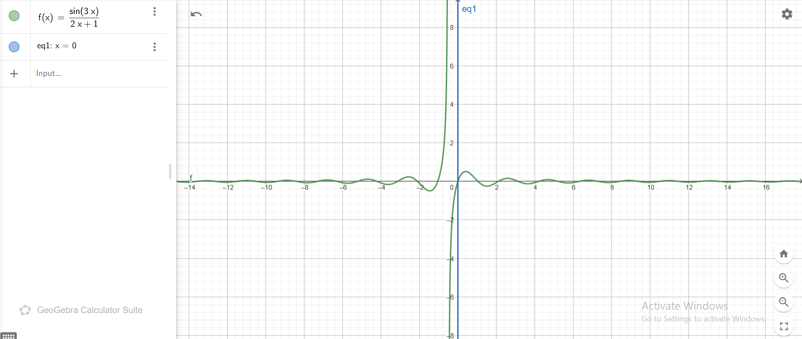

# Finding Asymptotes

We will find the asymptotes for the following functions:

1. $f(x) = \frac{x^2 - 1}{x^2 + 1}$
2. $g(x) = \frac{\sin(x)}{x^2 + 1}$

---

## 1. Asymptotes of $f(x) = \frac{x^2 - 1}{x^2 + 1}$

### Horizontal Asymptotes:
To find the horizontal asymptotes, compute:

$$
\lim_{x \to \infty} f(x) = \lim_{x \to \infty} \frac{x^2 - 1}{x^2 + 1}.
$$

Factor out $x^2$ in both the numerator and the denominator:

$$
\frac{x^2 - 1}{x^2 + 1} = \frac{1 - \frac{1}{x^2}}{1 + \frac{1}{x^2}}.
$$

As $x \to \infty$, the terms $\frac{1}{x^2} \to 0$, so:

$$
\lim_{x \to \infty} f(x) = \frac{1 - 0}{1 + 0} = 1.
$$

Similarly, as $x \to -\infty$, the result is the same:

$$
\lim_{x \to -\infty} f(x) = \frac{1 - 0}{1 + 0} = 1.
$$

Thus, the **horizontal asymptote** is:

$$
y = 1.
$$

### Vertical Asymptotes:
The denominator of $f(x)$ is $x^2 + 1$. Since $x^2 + 1 > 0$ for all $x \in \mathbb{R}$, there are no points where the denominator is $0$. Therefore, there are **no vertical asymptotes**.

---

## 2. Asymptotes of $g(x) = \frac{\sin(x)}{x^2 + 1}$

### Horizontal Asymptotes:
To find the horizontal asymptotes, compute:

$$
\lim_{x \to \infty} g(x) = \lim_{x \to \infty} \frac{\sin(x)}{x^2 + 1}.
$$

Since $\sin(x)$ oscillates between $-1$ and $1$, and the denominator $x^2 + 1 \to \infty$ as $x \to \infty$, we have:

$$
\frac{\sin(x)}{x^2 + 1} \to 0 \quad \text{as } x \to \infty.
$$

Similarly, as $x \to -\infty$:

$$
\frac{\sin(x)}{x^2 + 1} \to 0 \quad \text{as } x \to -\infty.
$$

Thus, the **horizontal asymptote** is:

$$
y = 0.
$$

### Vertical Asymptotes:
The denominator of $g(x)$ is $x^2 + 1$. Since $x^2 + 1 > 0$ for all $x \in \mathbb{R}$, the function is defined everywhere, and there are **no vertical asymptotes**.

---

## Summary of Asymptotes

1. For $f(x) = \frac{x^2 - 1}{x^2 + 1}$:
   - **Horizontal Asymptote**: $y = 1$
   - **Vertical Asymptote**: None

2. For $g(x) = \frac{\sin(x)}{x^2 + 1}$:
   - **Horizontal Asymptote**: $y = 0$
   - **Vertical Asymptote**: None
   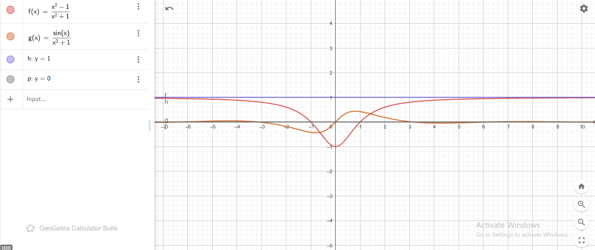

   ## 21. Derivatives
   # Compute Derivatives of Functions

Here are the derivatives of the given functions:

---

## 1. $y(x) = -3x + 3$

The derivative is:

$$
y'(x) = \frac{d}{dx}(-3x + 3) = -3.
$$

---

## 2. $y(x) = \pi x + \sin(1)$

The derivative is:

$$
y'(x) = \frac{d}{dx}(\pi x + \sin(1)) = \pi.
$$

---

## 3. $y(x) = 4 + \sin(2)$

The derivative is:

$$
y'(x) = \frac{d}{dx}(4 + \sin(2)) = 0.
$$

---

## 4. $y(x) = 2x^3 - 3x^2 + 8x - 9$

The derivative is:

$$
y'(x) = \frac{d}{dx}(2x^3 - 3x^2 + 8x - 9) = 6x^2 - 6x + 8.
$$

---

## 5. $y(x) = 6x^{1/3}$

The derivative is:

$$
y'(x) = \frac{d}{dx}(6x^{1/3}) = 6 \cdot \frac{1}{3}x^{-2/3} = 2x^{-2/3}.
$$

---

## 6. $y(x) = \sqrt{x}$

The derivative is:

$$
y'(x) = \frac{d}{dx}(\sqrt{x}) = \frac{1}{2\sqrt{x}}.
$$

---

## 7. $y(x) = \cos(x) + \sin(x)$

The derivative is:

$$
y'(x) = \frac{d}{dx}(\cos(x) + \sin(x)) = -\sin(x) + \cos(x).
$$

---

## 8. $y(x) = 2\sin(x)\cos(x)$

The derivative is (using the product rule):

$$
y'(x) = 2(\cos^2(x) - \sin^2(x)) = 2\cos(2x).
$$

---

## 9. $y(x) = x\sin(x)$

The derivative is (using the product rule):

$$
y'(x) = \frac{d}{dx}(x\sin(x)) = \sin(x) + x\cos(x).
$$

---

## 10. $y(x) = (x+1)(x+1)$

The derivative is:

$$
y'(x) = \frac{d}{dx}((x+1)^2) = 2(x+1).
$$

---

## 11. $y(x) = \frac{x}{x+1}$

The derivative is (using the quotient rule):

$$
y'(x) = \frac{(x+1)(1) - (x)(1)}{(x+1)^2} = \frac{1}{(x+1)^2}.
$$

---

## 12. $y(x) = (x+1)\exp(x)$

The derivative is (using the product rule):

$$
y'(x) = \frac{d}{dx}((x+1)\exp(x)) = \exp(x) + (x+1)\exp(x) = (x+2)\exp(x).
$$

---

## 13. $y(x) = \sin(x^2)$

The derivative is (using the chain rule):

$$
y'(x) = \cos(x^2) \cdot \frac{d}{dx}(x^2) = 2x\cos(x^2).
$$

---

## 14. $y(x) = \exp(-2x)$

The derivative is:

$$
y'(x) = \frac{d}{dx}(\exp(-2x)) = -2\exp(-2x).
$$

---

## 15. $y(x) = \frac{1}{\sin(x+1)}$

The derivative is (using the chain rule):

$$
y'(x) = \frac{d}{dx}(\sin(x+1)^{-1}) = -\frac{\cos(x+1)}{\sin^2(x+1)}.
$$

---

## 16. $y(x) = \sqrt{2x+1}$

The derivative is:

$$
y'(x) = \frac{d}{dx}((2x+1)^{1/2}) = \frac{1}{2}(2x+1)^{-1/2} \cdot 2 = \frac{1}{\sqrt{2x+1}}.
$$
1-5
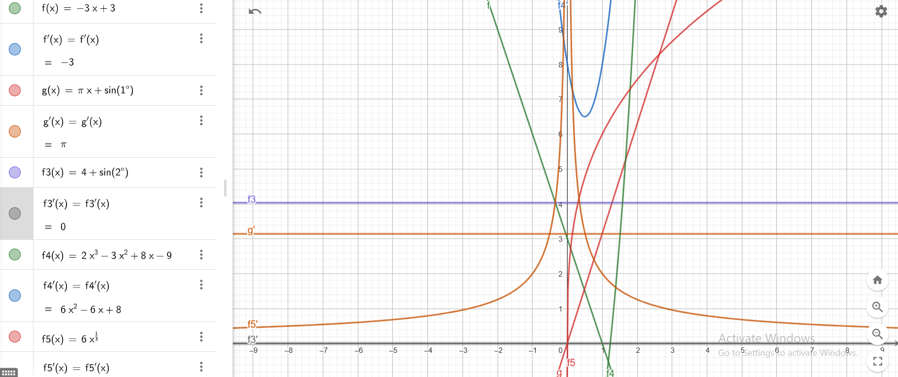
6-10
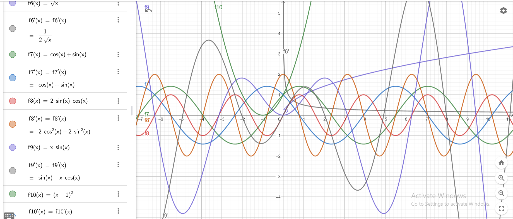
11-13
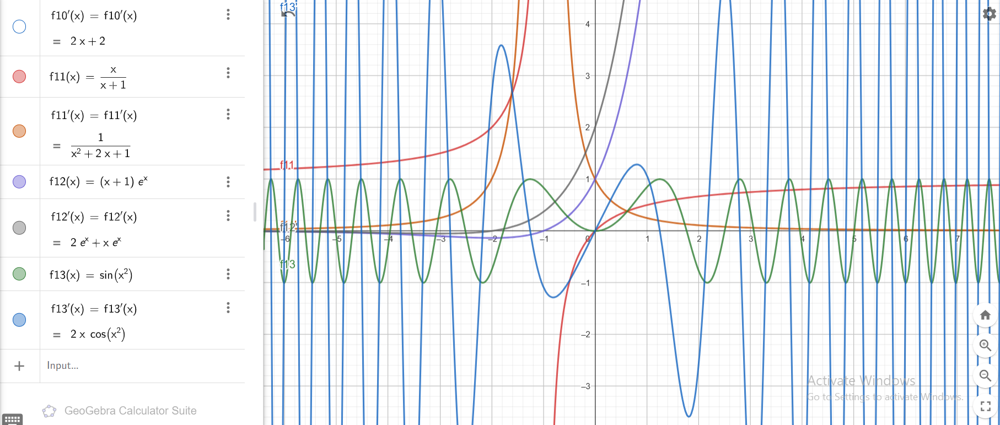
14-16
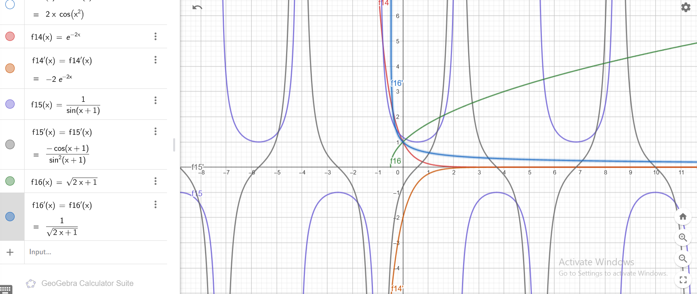

# Proof of $\frac{d}{dx} (\ln(\sin(x))) = \cot(x)$

We aim to prove that:

$$
\frac{d}{dx} (\ln(\sin(x))) = \cot(x).
$$

---

## Step 1: Use the Chain Rule

The derivative of $\ln(u)$ with respect to $x$ is:

$$
\frac{d}{dx} (\ln(u)) = \frac{1}{u} \cdot \frac{du}{dx}.
$$

Here, let $u = \sin(x)$. Substituting $u$ into $\ln(u)$:

$$
\frac{d}{dx} (\ln(\sin(x))) = \frac{1}{\sin(x)} \cdot \frac{d}{dx} (\sin(x)).
$$

---

## Step 2: Differentiate $\sin(x)$

The derivative of $\sin(x)$ is:

$$
\frac{d}{dx} (\sin(x)) = \cos(x).
$$

Substitute this back into the equation:

$$
\frac{d}{dx} (\ln(\sin(x))) = \frac{\cos(x)}{\sin(x)}.
$$

---

## Step 3: Simplify the Result

The expression $\frac{\cos(x)}{\sin(x)}$ is the definition of $\cot(x)$:

$$
\frac{\cos(x)}{\sin(x)} = \cot(x).
$$

---

## Conclusion

Thus, we have proved that:

$$
\frac{d}{dx} (\ln(\sin(x))) = \cot(x).
$$
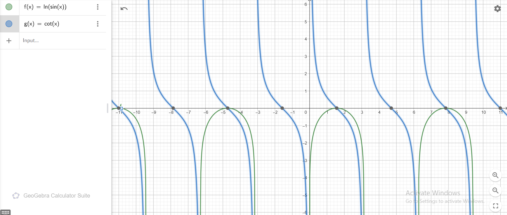

# Verification: For $f(x) = \cos(x)$, show that $f''(x) = -f(x)$

We aim to verify that the second derivative of $f(x) = \cos(x)$ satisfies:

$$
f''(x) = -f(x).
$$

---

## Step 1: Compute the First Derivative

The first derivative of $f(x) = \cos(x)$ is:

$$
f'(x) = \frac{d}{dx}(\cos(x)) = -\sin(x).
$$

---

## Step 2: Compute the Second Derivative

The second derivative is the derivative of $f'(x) = -\sin(x)$:

$$
f''(x) = \frac{d}{dx}(-\sin(x)) = -\cos(x).
$$

---

## Step 3: Relate $f''(x)$ to $f(x)$

Since $f(x) = \cos(x)$, we observe that:

$$
f''(x) = -\cos(x) = -f(x).
$$

---

## Conclusion

We have verified that for $f(x) = \cos(x)$:

$$
f''(x) = -f(x).
$$
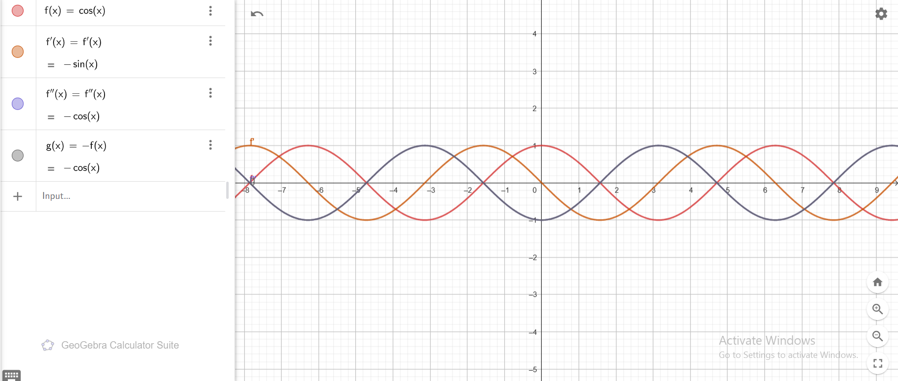

# Improper Limits Using de l'Hospital's Rule

---

## **1. Find** $\lim_{x\to 0} \frac{\sin{x}}{x}$

### Step 1: Form of the Limit
As $x \to 0$:
- $\sin(x) \to 0$ and $x \to 0$.
- The limit is in the indeterminate form $\frac{0}{0}$, so we apply **de l'Hospital's Rule**.

### Step 2: Differentiate Numerator and Denominator
The derivatives are:
- $\frac{d}{dx} (\sin(x)) = \cos(x)$
- $\frac{d}{dx} (x) = 1$

Using de l'Hospital's Rule:

$$
\lim_{x \to 0} \frac{\sin{x}}{x} = \lim_{x \to 0} \frac{\cos{x}}{1}.
$$

### Step 3: Evaluate the Limit
Substitute $x = 0$ into $\cos(x)$:

$$
\lim_{x \to 0} \frac{\cos{x}}{1} = \cos(0) = 1.
$$

### Final Result:
$$
\lim_{x \to 0} \frac{\sin{x}}{x} = 1.
$$

---

## **2. Find** $\lim_{x \to \infty} \frac{\ln x}{x}$

### Step 1: Form of the Limit
As $x \to \infty$:
- $\ln(x) \to \infty$ and $x \to \infty$.
- The limit is in the indeterminate form $\frac{\infty}{\infty}$, so we apply **de l'Hospital's Rule**.

### Step 2: Differentiate Numerator and Denominator
The derivatives are:
- $\frac{d}{dx} (\ln(x)) = \frac{1}{x}$
- $\frac{d}{dx} (x) = 1$

Using de l'Hospital's Rule:

$$
\lim_{x \to \infty} \frac{\ln{x}}{x} = \lim_{x \to \infty} \frac{\frac{1}{x}}{1}.
$$

### Step 3: Simplify and Evaluate
Simplify the fraction:

$$
\lim_{x \to \infty} \frac{\frac{1}{x}}{1} = \lim_{x \to \infty} \frac{1}{x}.
$$

As $x \to \infty$, $\frac{1}{x} \to 0$.

### Final Result:
$$
\lim_{x \to \infty} \frac{\ln{x}}{x} = 0.
$$

---

## **3. Find** $\lim_{x \to \infty} \frac{\exp(x)}{x}$

### Step 1: Form of the Limit
As $x \to \infty$:
- $\exp(x) \to \infty$ and $x \to \infty$.
- The limit is in the indeterminate form $\frac{\infty}{\infty}$, so we apply **de l'Hospital's Rule**.

### Step 2: Differentiate Numerator and Denominator
The derivatives are:
- $\frac{d}{dx} (\exp(x)) = \exp(x)$
- $\frac{d}{dx} (x) = 1$

Using de l'Hospital's Rule:

$$
\lim_{x \to \infty} \frac{\exp{x}}{x} = \lim_{x \to \infty} \frac{\exp{x}}{1}.
$$

### Step 3: Evaluate the Limit
As $x \to \infty$, $\exp(x) \to \infty$.

### Final Result:
$$
\lim_{x \to \infty} \frac{\exp{x}}{x} = \infty.
$$
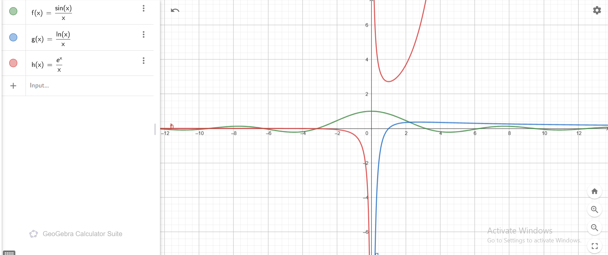

# Finding Velocity and Acceleration of the Particle

The position of the particle is given by:

$$
x(t) = 3t^2 - 6t + 1.
$$

We aim to find the velocity \(V(t) = x'(t)\), the acceleration \(a(t) = V'(t) = x''(t)\), and their values at \(t = 2\).

---

## Step 1: Compute Velocity \(V(t) = x'(t)\)

The velocity is the derivative of the position function \(x(t)\):

$$
V(t) = \frac{d}{dt}(3t^2 - 6t + 1).
$$

Using basic derivative rules:

$$
V(t) = 6t - 6.
$$

---

## Step 2: Compute Acceleration \(a(t) = V'(t) = x''(t)\)

The acceleration is the derivative of the velocity \(V(t)\):

$$
a(t) = \frac{d}{dt}(6t - 6).
$$

Using basic derivative rules:

$$
a(t) = 6.
$$

---

## Step 3: Evaluate at \(t = 2\)

### Velocity at \(t = 2\):
Substitute \(t = 2\) into \(V(t) = 6t - 6\):

$$
V(2) = 6(2) - 6 = 12 - 6 = 6.
$$

### Acceleration at \(t = 2\):
The acceleration is constant, so:

$$
a(2) = 6.
$$

---

## Final Results

At \(t = 2\), the velocity and acceleration of the particle are:

- **Velocity**: \(V(2) = 6\)
- **Acceleration**: \(a(2) = 6\)

